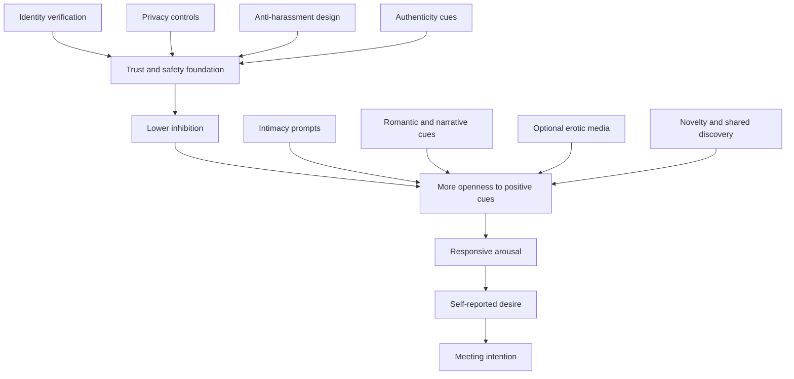
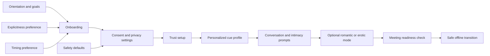

# Ethical Design Principles for Digital Environments That Support Desire for Meeting Men Online in Adult Women

## Executive summary

The most robust conclusion from contemporary sexology is that sexual arousal and desire in adult women are highly **context-sensitive** rather than being driven mainly by isolated explicit stimuli. Compared with men, women show substantially lower concordance between genital and self-reported arousal in laboratory studies, which means that what matters most for design is not simply whether a cue is physiologically activating, but whether it is experienced as welcome, safe, meaningful, and erotically relevant by the user herself. Modern models of women’s sexual response therefore emphasize responsive desire, incentive salience, and the balance between sexual excitation and sexual inhibition in a given situation. citeturn19view0turn22view0turn4view6turn4view5

Across peer-reviewed studies, the most reliable desire-enhancing factors are not sensory tricks alone. They are: **perceived safety and trust**, **privacy**, **emotional bonding and partner responsiveness**, **feeling desired rather than used**, **lower cognitive distraction and body self-consciousness**, **intimacy cues**, and **novelty or self-expansion** that makes the interaction feel fresh without feeling risky. In couples research, intimacy predicts attention to positive sexual cues, which in turn predicts greater desire and satisfaction; in online-dating and digital-intimacy research, women consistently describe unsafety, deception, and vigilance as central determinants of whether they can engage openly. citeturn16view0turn4view3turn23search3turn12view2turn12view1turn12view3

Evidence for classic “environmental” variables is more uneven. There is **modest but suggestive evidence** for music and audio as arousal-adjacent mood amplifiers; **limited and mixed evidence** for scent-related effects; and **weak direct sexual-response evidence** for lighting and temperature, although both plausibly matter indirectly through mood regulation, privacy, thermal comfort, and reduced self-consciousness. Sleep quality, stress, negative mood, and fatigue are far more consistently linked to women’s sexual functioning than any one ambient design detail. citeturn10view1turn10view2turn28search3turn27search2turn27search7turn16view4turn10view5turn10view6

For a digital product, the practical implication is clear: if the goal is to increase desire for meeting men online, the design should **not** aim at covert arousal manipulation. It should instead create a user-controlled environment that lowers inhibition and raises genuine erotic relevance: strong trust signals, optional privacy and pacing controls, emotionally responsive interaction design, personalized narrative/romantic/erotic content, body-image-sensitive visual design, and novelty features that preserve autonomy. This is also the ethically and legally safer path, because manipulative design patterns, deceptive consent flows, and careless handling of sexuality-related data are exactly the areas that privacy and consumer regulators warn against. citeturn21search8turn21search16turn21search1turn21search2turn30search5turn30search4

## What the evidence says about women’s arousal in context

A rigorous reading of the literature points to a three-part model. First, sexual desire in many women is often **responsive** rather than strongly spontaneous: desire frequently emerges after an interaction has already become affectively or erotically engaging. Second, that arousal-to-desire pathway is moderated by relationship quality, emotional meaning, and the perceived outcomes of engaging. Third, inhibitory processes matter as much as excitatory ones: threat, shame, body surveillance, mistrust, fatigue, stress, and unfair relational dynamics can suppress desire even when sexual cues are present. citeturn22view0turn22view1turn4view6turn16view4

This explains a longstanding empirical pattern: women’s self-reported arousal and genital arousal are correlated, but much less tightly than men’s. In a meta-analysis of 132 laboratory studies, the average correlation was about **r = .26 for women versus r = .66 for men**. That is one reason why product design should optimize for users’ **subjective comfort, excitement, trust, erotic fit, and willingness** rather than assuming that exposure to sexualized content will translate directly into desire or meeting intent. citeturn19view0

Relational context repeatedly appears as one of the strongest moderators. In one study of women viewing a sexual film, subjective sexual arousal predicted desire, but the association depended on **relationship satisfaction** and whether the desire target was one’s partner or someone else. In a related psychophysiology study, women with sexual interest/arousal difficulties did not necessarily have weaker genital responses; rather, the way arousal translated into partner-directed desire depended on relationship quality. In daily diary work, intimacy increased attention to positive sexual cues, which then increased desire and satisfaction. citeturn22view0turn22view1turn16view0

Qualitative work converges with that account. In focus groups, women identified feeling **desired rather than used**, **accepted rather than judged**, comfortable with their bodies, free from unwanted pregnancy concerns or reputational threat, and in a receptive mood as important enhancers of arousal; negative mood, self-consciousness, and unsafe or pressuring approaches worked in the opposite direction. The validated Cues for Sexual Desire Scale then organized women’s desire triggers into four broad groups: **Emotional Bonding**, **Erotic/Explicit**, **Visual/Proximity**, and **Implicit/Romantic** cues. citeturn23search3turn23search6turn37view1turn36view1

For digital design, this means the most effective environment is usually not the most explicit one. It is the environment that helps the user feel that erotic engagement is **voluntary, safe, personally meaningful, and attuned to her preferred cue profile**. citeturn37view1turn16view0turn4view3

## Detailed findings by attribute

The table below separates attributes by how directly they are supported in the women’s sexual-arousal literature and how confidently they can be translated into digital design.

| Attribute | What the evidence most strongly supports | Evidence strength | Design implication |
|---|---|---:|---|
| **Perceived safety, trust, authenticity** | Women in online-dating studies emphasize unsafety, deception, physical danger, and the labor of staying safe; perceived trustworthiness and safety are strong predictors of dating intentions in platform research. Women also show reduced interest in men whose profiles contain threat cues. citeturn12view2turn12view1turn12view3turn24search0turn24search10 | **High** | Make trust the first-order design variable: verification, recent-photo assurance, transparent moderation, easy reporting, and clear signals of accountability should come before any erotic escalation. |
| **Privacy and control** | Desire and pleasure research repeatedly frames safety, rights, and autonomy as foundational. Clinical guidance on low desire uses a biopsychosocial model and stresses modifiable contextual factors rather than purely “within-person” deficits. citeturn32view0turn18search11turn18search13 | **High** | Offer controls for audience, pace, explicitness, notification timing, screenshot protection where possible, and easy exit without penalty. |
| **Emotional bonding, partner responsiveness, intimacy** | Intimacy and partner responsiveness correlate positively with sexual desire. In daily diary work, greater intimacy predicted more attention to positive sexual cues and greater desire. CSDS work shows emotional-bonding cues are central, and postmenopausal women may lean even more on these cues. citeturn4view3turn16view0turn36view1turn37view3 | **High** | Design interactions to convey warmth, attentiveness, curiosity, supportiveness, and mutual interest before pushing rapid conversion to dates. |
| **Feeling desired, accepted, not used** | Focus-group data identify feeling desired rather than used, and accepted rather than judged, as key enhancers of women’s arousal; sexual communication and responsiveness appear to support this. citeturn23search3turn23search6turn13search17 | **High** | Encourage profile and messaging formats that signal appreciation, respect, and specific positive attention rather than generic sexual pursuit. |
| **Body image, self-consciousness, distraction** | Negative body image is linked to stronger avoidance motives, more distraction, less pleasure, and worse sexual function. Reviews consistently link body satisfaction with better sexual well-being. citeturn34view1turn9search9turn9search3turn9search18 | **High** | Reduce exposure to hyper-idealized imagery, beauty-filter pressure, and public performance pressures; favor private, low-surveillance, low-comparison interaction spaces. |
| **Novelty and self-expansion** | Overfamiliarity and routine are associated with lower desire in long-term contexts. Self-expansion predicts higher desire and greater affection, and novelty interventions show promise when boredom is a driver. citeturn15search7turn20search2turn20search10turn20search3 | **Moderate to high** | Refresh interaction with playful prompts, new shared topics, rotating “micro-adventure” ideas, and optional discovery mechanics that feel exciting rather than chaotic. |
| **Erotic/explicit content** | Explicit and erotic cues matter for many women, and the CSDS identified them as one of four major cue domains. But women vary greatly, subjective and genital arousal can diverge, and explicitness without context often works less predictably than in men. citeturn37view1turn39view3turn19view0turn29view1 | **Moderate** | Keep erotic content strictly opt-in, orientation-sensitive, and nested inside trust and pacing controls. |
| **Narrative, fantasy, role-play** | Sexual fantasy research is overall neutral-to-positive for women’s satisfaction and function; audio narratives and erotic texts can elicit arousal-related emotional and neural responses, but responses are heterogeneous and can include shame or aversion. citeturn10view4turn28search3turn28search0turn29view0 | **Moderate** | Text and audio can outperform blunt visuals for some users. Offer optional fantasy, flirty story prompts, or scenario-based interaction instead of relying on images alone. |
| **Visual/proximity cues** | Visual and proximity cues are one validated cue category, but women’s subjective response tends to be more category-specific than genital response, and relationship context matters. Idealized or filtered presentation can undermine trust. citeturn36view1turn39view2turn29view0turn3search17 | **Moderate** | Use high-authenticity visuals: recent, minimally edited photos, naturalistic micro-video, and behavioral cues of warmth/confidence rather than glossy perfection. |
| **Music and sound** | Music and sex share reward-related circuitry; evidence for music as an adjunct to sexual response is promising but still sparse. Experimental work shows music-induced arousal can increase women’s attraction ratings. Audio erotica also evokes emotional responses, though not uniformly positive. citeturn10view1turn10view2turn11view2turn28search3 | **Moderate** | Use optional soundscapes, playlists, or voice-based flirting. Never autoplay. Let users control valence, pace, and explicitness. |
| **Scent** | Pleasant scents appear as romantic/implicit cues in the CSDS, and olfaction matters in romantic relationships; however, evidence for specific human chemosignals in women remains limited and mixed. citeturn37view4turn27search2turn27search7turn27search11 | **Low to moderate** | Digital products cannot deliver scent directly, but can suggest optional off-screen rituals such as fragrance, skincare, or a personalized “get-in-the-mood” environment. |
| **Lighting and color** | Direct sexual-arousal evidence is limited. Lighting clearly affects affective impression and emotional arousal in general, and body-image/self-consciousness research suggests environments that reduce self-surveillance are preferable. citeturn9search19turn9search16turn34view1 | **Low** | Treat this as an inference: prefer warm, softer, low-glare visual themes and camera defaults that flatter without distortion. |
| **Temperature and physical comfort** | Direct evidence linking ambient temperature to women’s sexual desire is weak; thermal-comfort research nonetheless shows sex differences in comfort preferences, and cold discomfort can be distracting. Other state variables such as sleep and stress are more strongly evidenced. citeturn26search20turn26search4turn10view5turn16view4 | **Low** | Do not overengineer temperature. Instead, support comfort with reminders, timing options, and optional “set your scene” suggestions. |
| **Stress, sleep, fatigue, timing** | Poor sleep is associated with worse sexual arousal and function; negative mood and poorer emotion regulation interfere more strongly with women’s sexual well-being than men’s. Daily-life work suggests women’s desire/arousal may rise slightly in the evening and that tiredness is, if anything, more likely to hinder than help women’s desire. citeturn10view5turn16view4turn10view6 | **High** | Prioritize timing and state awareness over sensory gimmicks: user-scheduled windows, reduced late-night pressure, and self-check prompts can outperform ambient design tweaks. |

A particularly useful practical bridge from the CSDS research is that the cue categories already resemble product feature categories. Emotional-bonding items include things like feeling love, security, support, commitment, and emotional closeness; romantic/implicit items include whispering, dancing closely, romantic dinners, massage, laughter with a partner, and pleasant scents; explicit cues include erotic movies, “talking dirty,” fantasy, and direct sexual content; visual/proximity cues include flirting, confident behavior, physical attractiveness, and proximity to attractive people. citeturn37view3turn37view4turn39view1turn39view2

The important nuance is that these categories do **not** perform equally across all women or all life stages. Postmenopausal women in one study endorsed more emotional-bonding cues than premenopausal women, while erotica, visual/proximity, and romantic cues showed less menopausal differentiation. That suggests a digital environment should not force one pathway to desire; it should assess and adapt to the user’s cue profile. citeturn36view1

## Population specifics and variability

The evidence base is informative but not fully representative. Reviews of women’s sexual pleasure and fantasy repeatedly note that much of the literature overrepresents **Western, cisgender, heterosexual women**, often in younger or midlife age bands and frequently in partnered or laboratory contexts. That means a platform should treat aggregate findings as defaults to test, not as universal truths. citeturn32view0turn14search7turn7search1

Age matters, but not in a simple straight-line way. Large-sample data show women’s reported sexual desire tends to decline with age on average, more steeply than men’s, yet menopause does not remove the importance of sexuality or of desire-supporting contexts. Postmenopausal women may place even more weight on emotional-bonding cues, and qualitative reviews of older women emphasize that sexuality remains meaningful when supported by health, intimacy, and sociocultural permission rather than being reduced to a narrow biomedical model. citeturn25search0turn36view1turn15search3

Sexual orientation also changes the picture. Chivers’ review argues that women’s physiological and subjective responses do not map onto orientation as simply as men’s do, especially among androphilic women, and relational/bodily theories of women’s desire explicitly call for models that include heterosexual, bisexual, and lesbian women. Recent large-sample work also suggests that bisexual and pansexual respondents may report higher desire on average than heterosexual women. For product design, this means erotic and romantic cues must be **orientation-aware and user-selectable**, not assumed from sex category alone. citeturn19view1turn14search2turn25search0

Relationship status is likewise central. In long-term relationships, desire is shaped by responsiveness, intimacy, fairness, self-expansion, routine, and household inequity; in online dating among single women or women newly meeting men, the strongest moderators are often **safety, authenticity, and reputation risk**. A useful default, if relationship status is not specified, is therefore to build first for a user who wants connection but needs to feel secure before erotic engagement becomes appealing. citeturn16view2turn20search10turn15search7turn12view2

Cultural and individual differences are not side notes. The pleasure literature highlights sexual autonomy and assertiveness as beneficial, while sexual compliance and gender power imbalances compromise women’s pleasure. In practice, this means the same interface may feel freeing to one user and pressuring to another, depending on norms around modesty, privacy, gender roles, religion, prior trauma, and personal erotic style. Personalization is therefore not just a growth feature; it is a validity requirement. citeturn32view0

## Actionable recommendations for an ethical digital environment

The design goal should be stated precisely: **support self-directed desire and willingness to meet, not engineer arousal without awareness**. The strongest product strategy is a “trust-first, intimacy-second, erotics-third” progression, because the research suggests many women need inhibition lowered before excitation cues can work reliably. citeturn4view6turn12view2turn16view0

### Recommended feature map

| Research-backed need | Recommended digital implementation | Why it maps to the evidence | Main risk to watch |
|---|---|---|---|
| Safety and authenticity | Verified identity, optional recent-photo confirmation, visible moderation actions, clear community rules, easy block/report, fraud warnings integrated into the flow | Safety and trust are preconditions for willingness to engage; women describe vigilance and danger as core online-dating realities. citeturn12view1turn12view2turn12view3turn21search3 | Overcollection of sensitive data; verification must be privacy-minimizing. citeturn21search2turn30search5 |
| Privacy and pacing control | User-set visibility, mode for blurred photos until mutual consent, “slow reveal” controls, explicitness sliders, silence hours, incognito browsing | Desire is more likely when the user controls pace, audience, and disclosure. citeturn18search11turn32view0turn16view4 | Dark patterns that make privacy hard to find or decline are legally risky. citeturn21search1turn21search8 |
| Emotional bonding | Conversation starters about values, humor, care, ambitions, everyday responsiveness; prompts that reward memory, listening, and follow-up | Intimacy and partner responsiveness reliably predict desire and sexual well-being. citeturn4view3turn16view0turn13search17 | Can feel formulaic if over-scripted; keep optional and varied. |
| Feeling desired, not objectified | Templates for specific appreciative compliments, visible “why I’m interested” notes, anti-copy-paste friction | Feeling desired and accepted supports arousal; generic or objectifying pursuit can feel threatening or dehumanizing. citeturn23search3turn23search6 | May be gamed by harassers if moderation is weak. |
| Lower distraction and body self-consciousness | Low-clutter interface, reduced social-comparison cues, no mandatory “hotness” sorting, camera defaults that soften glare rather than beautify, minimal beauty-filter culture | Negative body image and distraction predict lower pleasure and worse function. citeturn34view1turn9search9 | Excessive polishing may raise attractiveness but reduce trust. citeturn3search17 |
| Romantic and narrative cueing | Opt-in romantic modes: soft visual theme, text/audio flirt prompts, “story card” exchanges, shared fantasy prompts with consent gates | Fantasy and narrative erotica can be positive for women, and implicit/romantic cues are a validated desire domain. citeturn10view4turn37view4turn28search0turn28search3 | Users differ sharply; some will find it embarrassing or intrusive. |
| Novelty and self-expansion | Rotating prompts, “discover each other” games, collaborative mini-challenges, novel but low-pressure date ideas | Self-expansion and novelty help counter boredom and support desire. citeturn20search2turn20search10turn15search7 | Novelty can become overstimulation if it undermines predictability or safety. |
| Sensory support | Optional playlists, voice notes, ambient suggestions for offline scene-setting, favorite scents/music rituals saved in profile privately | Music has modest empirical support; scent is plausible but weakly evidenced, so it should stay optional and indirect. citeturn10view1turn10view2turn27search2turn37view4 | Autoplay or surprise sensory prompts will feel manipulative. |
| State awareness | User-chosen check-ins such as “up for chat,” “want romance not sexual talk,” “low-energy tonight,” or “prefer daytime planning” | Stress, poor sleep, and negative mood suppress well-being more reliably than many sensory tweaks. citeturn10view5turn16view4turn10view6 | Avoid health inference without consent. |
| Meeting transition | Mutual-interest checkpoint, public-place defaults, consent and safety reminders, “share plan with a friend” option | Desire for meeting should rise alongside safety, not outrun it. Women often use technology to mitigate assault risk. citeturn12view1turn12view2 | If overbearing, reminders can break momentum; make them timely and optional but salient. |

A sensible user journey is therefore one where the product first reduces inhibition and uncertainty, then supports connection and attraction, then offers carefully gated romantic or erotic intensification.

### Practical design principles

A strong product would begin by asking a small number of user-controlled questions: who the user wants to meet, what pace she prefers, what kinds of cues tend to feel engaging, and what content she does **not** want. This is directly aligned with the diversity and cue-profile findings in the literature. citeturn37view1turn19view1turn32view0

The visual design should aim for **comfort and authenticity**, not maximal stimulation. That means cleaner screens, warmer low-glare palettes, fewer comparison mechanics, more naturalistic imagery, and less emphasis on beauty-filtered perfection. The direct sexual evidence for lighting itself is weak, but the body-image and distraction evidence is strong enough to justify this as a conservative, evidence-consistent inference. citeturn34view1turn9search19turn9search16

Conversation design should put disproportionate weight on **responsiveness**. Men who remember details, ask specific questions, and react with care communicate the very cues that the arousal literature repeatedly marks as important: being valued, supported, understood, and desired in a way that is not dehumanizing. citeturn4view3turn16view0turn23search3

Erotic escalation should be strictly **opt-in and layered**. Some women respond positively to explicit imagery or erotic media; others will respond better to suggestive language, narrative, audio, or romantic implication. The product should therefore support multiple routes: from affectionate banter, to voice notes, to story-based flirting, to explicit content only after mutual consent. citeturn36view1turn10view4turn28search3turn29view0

Novelty should be introduced as **playful discovery**, not unpredictability in core safety mechanisms. In other words, verification, reporting, privacy, and consent flows should be extremely stable and clear, while prompts, topics, and shared activities can rotate and refresh to preserve excitement. That distinction fits both the novelty literature and the privacy-design literature. citeturn20search2turn20search10turn21search1turn21search2

## Risks, mitigation, and validation

The biggest risk is ethical drift from “supporting desire” into **covert manipulation**. Consumer-protection and privacy regulators explicitly warn against dark patterns that steer users into consent, disclosure, spending, or risky behavior they would not otherwise choose. In this domain, that risk is amplified because the relevant data often involve sex life, sexual orientation, intimate images, and location. In European and UK-style privacy regimes, data concerning sex life and sexual orientation are treated as specially protected categories; in U.S. enforcement, the FTC has repeatedly framed deceptive design and weak protection of sensitive data as unfair or deceptive conduct. citeturn21search8turn21search1turn30search5turn30search4

The second major risk is **mis-optimization**. It is easy to build a system that increases swipes, message counts, or impulsive late-night behavior while decreasing genuine trust, comfort, and eventual meeting quality. This is especially likely if the product overuses idealized imagery, pressure cues, scarcity framing, or explicit content. Research on trustworthiness in dating contexts suggests that authenticity and safety matter, and research on body image suggests that comparison-heavy environments can actively reduce women’s erotic comfort. citeturn12view3turn34view1turn3search17

A third risk is **heteronormative overgeneralization**. Much of the evidence base comes from heterosexual samples or mixed samples where heterosexual women dominate. If the product silently assumes one cue profile, it will fail many users. The mitigation is explicit user choice, non-assumption about orientation or desired relationship type, and continual measurement of differential effects by segment. citeturn14search7turn19view1turn32view0

A fourth risk is **outreach or outing harm** through bad privacy architecture. Dating products can reveal sexual orientation, intimate preferences, and location patterns. Mitigations should therefore include data minimization, purpose limitation, strict defaults, retention controls, granular consent, and the avoidance of third-party sharing for ad targeting. citeturn21search2turn30search5turn30search4

### Suggested validation metrics

The product should treat **subjective desire, trust, and well-being** as primary outcomes, with business-conversion metrics secondary. Suitable primary measures include short state items for immediate desire and comfort, plus established scales where appropriate: the **FSFI** for desire/arousal/function domains in longer studies and the **SDI-2** for sexual desire across diverse populations and languages. citeturn31search16turn31search4turn31search1turn31search5

Behavioral metrics should be interpreted through a safety lens. Better signs include higher rates of **mutually initiated conversation**, longer reciprocal exchanges, more profile authenticity confirmations, higher meeting readiness after safety checks, lower block/report rates, lower image-manipulation use, and higher post-interaction trust ratings. Worse signs include more rapid explicit escalation, higher complaint rates, high late-night impulsive engagement, or increased self-reported discomfort, shame, or body self-consciousness. These “guardrail metrics” are especially important because erotic activation without trust can create the illusion of success while harming users. citeturn12view2turn23search3turn34view1

### Suggested experiments

The best empirical approach is a staged experimentation program. First, run **component-level A/B tests** on trust and privacy architecture before testing sensory or romantic features. Second, use **factorial experiments** to separate the effects of authenticity cues, intimacy prompts, optional audio/narrative features, and novelty mechanics. Third, use **daily diary or ecological momentary assessment** methods because desire fluctuates across days and contexts, and those designs are closer to how the underlying sexology is now studied. citeturn16view0turn5search8turn10view6

A strong experimental hierarchy would look like this: trust stack first, then relational prompts, then optional sensory/narrative features, then meeting-transition tools. That order follows the evidence hierarchy in this report. If the trust and inhibition layer does not work, the arousal-supporting layer will be unstable or ethically questionable. citeturn12view3turn4view3turn16view0turn21search8

## Bottom line

If the objective is to build a digital environment that increases adult women’s desire for meeting men online, the most defensible evidence-based strategy is **not** to intensify sexual explicitness. It is to design for **trust, privacy, autonomy, emotional responsiveness, low distraction, authenticity, optional romantic/erotic narrative, and safe novelty**. That combination aligns much more closely with what peer-reviewed sexology, psychophysiology, qualitative research, and clinical guidelines actually show about women’s desire. citeturn37view1turn16view0turn22view0turn19view0turn18search11

The sensory layer still matters, but mostly as a supporting cast. Music and audio can help; pleasant scent cues can matter for some users; softer lighting and thermal comfort are reasonable but lower-evidence complements. The main levers remain **context and meaning**: feeling safe, feeling wanted, feeling understood, and feeling that saying yes to a meeting remains fully voluntary and under one’s own control. citeturn10view1turn28search3turn37view4turn26search20turn23search3turn4view3